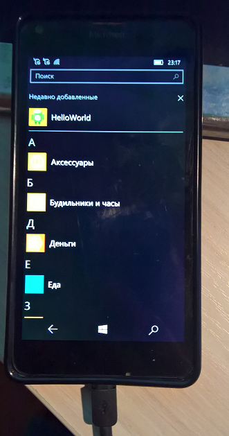

# ApkDeployment 

Old (hello, 2015!) Experimental ApkDeployment tool decompiled. 

Note: Astoria W10M os needed to test this thing (batch apk converting + auto-deployment).

JetBrains DotPeek used.

## The purpose
WConnect contolling via some GUI

# Screenshots
<table><tr>
<td>  </td>
<td>  </td>
<td>  </td>
</tr></table>

<table><tr>
<td>  </td>
<td>  </td>
<td>  </td>
</tr></table>

## My 2 cents
- Decomp. code quickly fixed.
- App starts and works ok. 

## Status
Complete but to be continued once upon the time...

## Testing details
- helloworld.apk is KitKat (4.4) - friendly. So, it deployed ok
- testdpc7.apk is not KitKat-compatible (api >=20). Deployment failed.
- Background "cmd window" set to normal (not hidden) visualization mode for better debug...

## .
AS IS. RnD only. No support.

## ..
[m][e] 2022, November. 